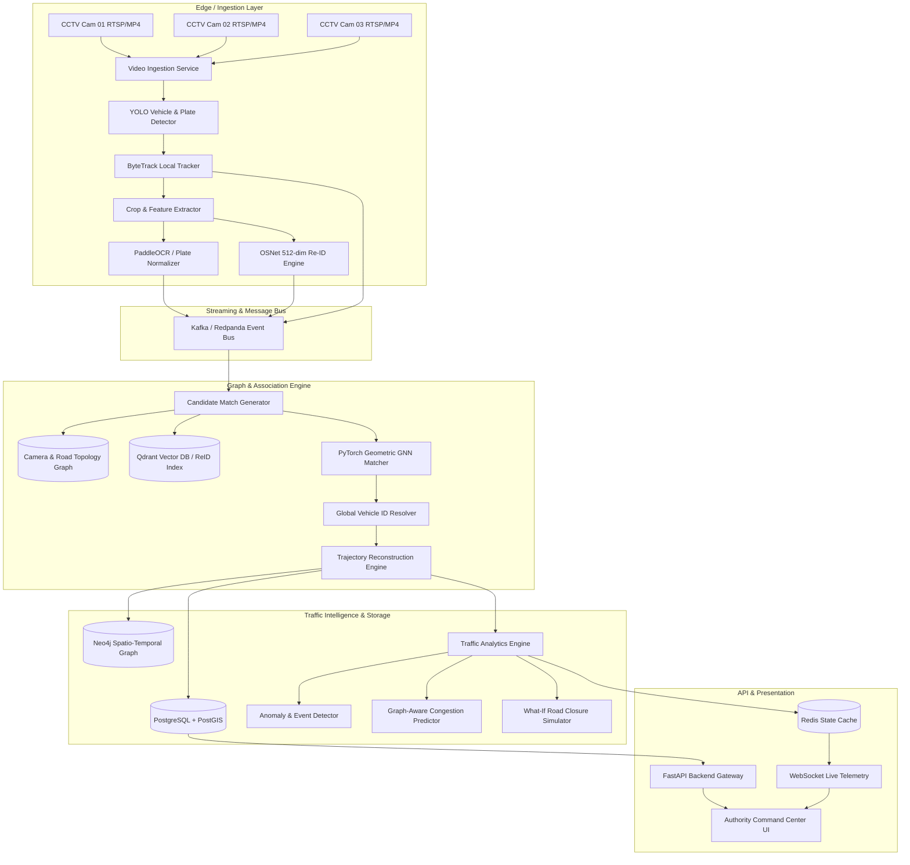

# URBANTRACK AI — System Design & Architecture (DESIGN)

## 1. Architectural Philosophy
The system adopts an event-driven, graph-centric, tiered architecture designed to isolate heavy edge computer vision from central spatio-temporal graph reasoning.

## 2. Multi-Signal Matching Hierarchy
Vehicle identity cannot be resolved purely by plates (occlusion, dirt, angle) nor purely by visual Re-ID (similar make/model/color). URBANTRACK AI uses a 6-signal fusion:

$$\text{Score}(u, v) = w_p \cdot S_{\text{plate}} + w_a \cdot S_{\text{reid}} + w_t \cdot S_{\text{type}} + w_s \cdot S_{\text{spatiotemporal}} + w_d \cdot S_{\text{direction}} + w_c \cdot S_{\text{topology}}$$

- **Spatial-temporal feasibility filter**: If $t_v - t_u < \frac{\text{dist}(C_u, C_v)}{v_{\max}}$ or $t_v - t_u > \frac{\text{dist}(C_u, C_v)}{v_{\min}}$, candidate score is strictly 0.
- **Learned GNN Layer**: PyTorch Geometric edge classifier refines candidate pairs using localized subgraph embeddings.
