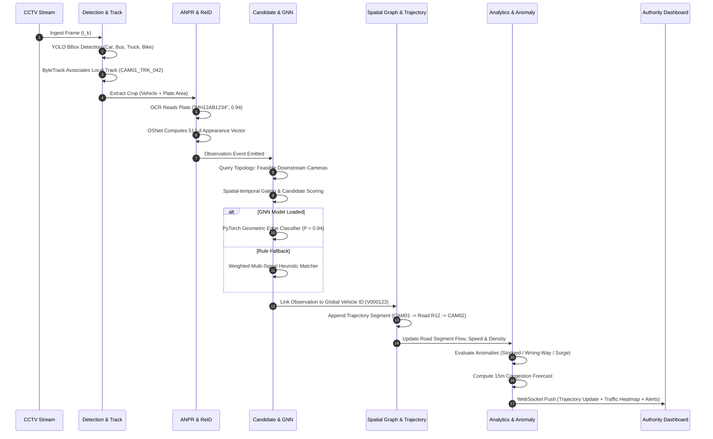

# URBANTRACK AI — Application Flow (APPFLOW)

## 1. End-to-End Processing Pipeline

## 2. User Journey Flows in Authority Dashboard
1. **Live Situation Awareness**: The operator views city-wide camera nodes, active road flow colors (Green/Yellow/Red), and real-time alerts.
2. **Suspect Vehicle Search**: Operator inputs a partial plate (e.g., `MH12%`) or global ID (`V000123`). The system displays the reconstructed path on the map, list of cameras traversed, transit durations, and snapshots.
3. **What-If Diversion Planning**: Operator marks Road R102 as "Closed" (simulating a sinkhole or VIP convoy). The simulation engine computes detours and predicts spillover traffic on alternate roads R104 and R105.
