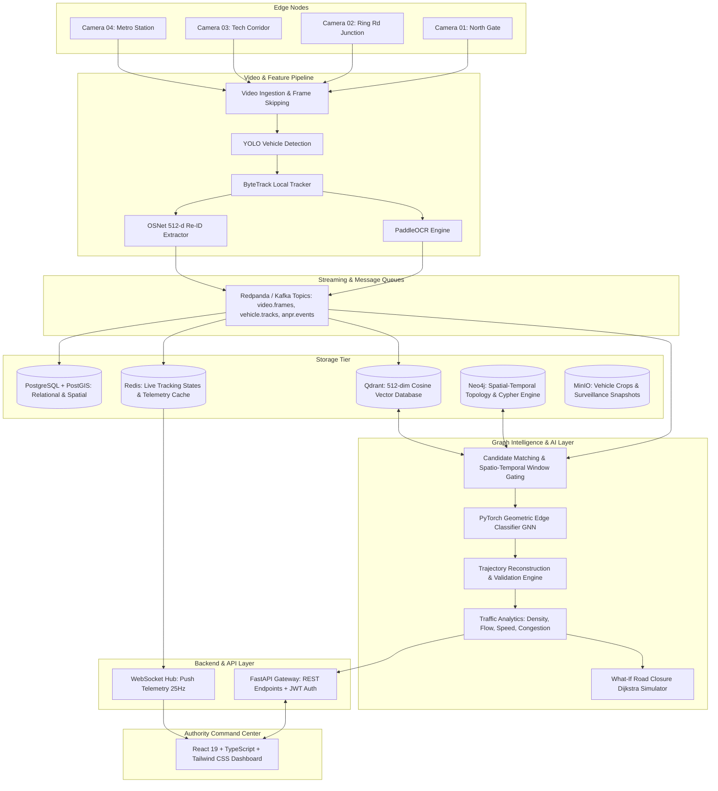

# URBANTRACK AI — Architecture Specification (ARCHITECTURE)

## 1. High-Level Multi-Tier Architecture

```mermaid
graph TB
    subgraph Edge Nodes
        C1[Camera 01: North Gate]
        C2[Camera 02: Ring Rd Junction]
        C3[Camera 03: Tech Corridor]
        C4[Camera 04: Metro Station]
    end

    subgraph Video & Feature Pipeline
        VP[Video Ingestion & Frame Skipping]
        YD[YOLO Vehicle Detection]
        BT[ByteTrack Local Tracker]
        OCR[PaddleOCR Engine]
        ReID[OSNet 512-d Re-ID Extractor]
    end

    C1 --> VP
    C2 --> VP
    C3 --> VP
    C4 --> VP
    VP --> YD --> BT --> OCR
    BT --> ReID

    subgraph Streaming & Message Queues
        Bus[Redpanda / Kafka Topics: video.frames, vehicle.tracks, anpr.events]
    end

    OCR --> Bus
    ReID --> Bus

    subgraph Storage Tier
        PG[(PostgreSQL + PostGIS: Relational & Spatial)]
        N4J[(Neo4j: Spatial-Temporal Topology & Cypher Engine)]
        QD[(Qdrant: 512-dim Cosine Vector Database)]
        RD[(Redis: Live Tracking States & Telemetry Cache)]
        MIO[(MinIO: Vehicle Crops & Surveillance Snapshots)]
    end

    Bus --> PG
    Bus --> QD
    Bus --> RD

    subgraph Graph Intelligence & AI Layer
        Cand[Candidate Matching & Spatio-Temporal Window Gating]
        GNN[PyTorch Geometric Edge Classifier GNN]
        Traj[Trajectory Reconstruction & Validation Engine]
        Intel[Traffic Analytics: Density, Flow, Speed, Congestion]
        Sim[What-If Road Closure Dijkstra Simulator]
    end

    Bus --> Cand
    N4J <--> Cand
    QD <--> Cand
    Cand --> GNN
    GNN --> Traj
    Traj --> Intel
    Intel --> Sim

    subgraph Backend & API Layer
        API[FastAPI Gateway: REST Endpoints + JWT Auth]
        WS[WebSocket Hub: Push Telemetry 25Hz]
    end

    Intel --> API
    RD --> WS

    subgraph Authority Command Center
        UI[React 19 + TypeScript + Tailwind CSS Dashboard]
    end

    API <--> UI
    WS --> UI
```
